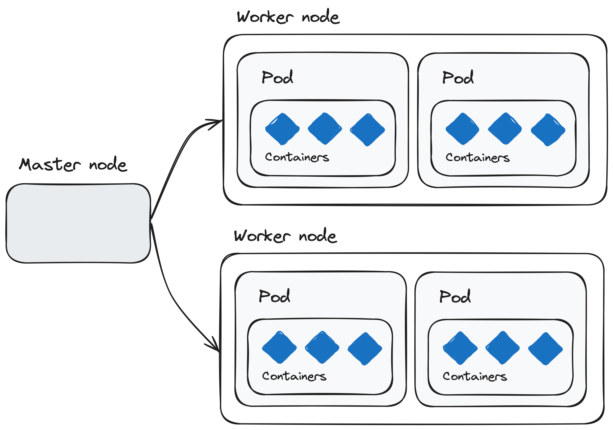
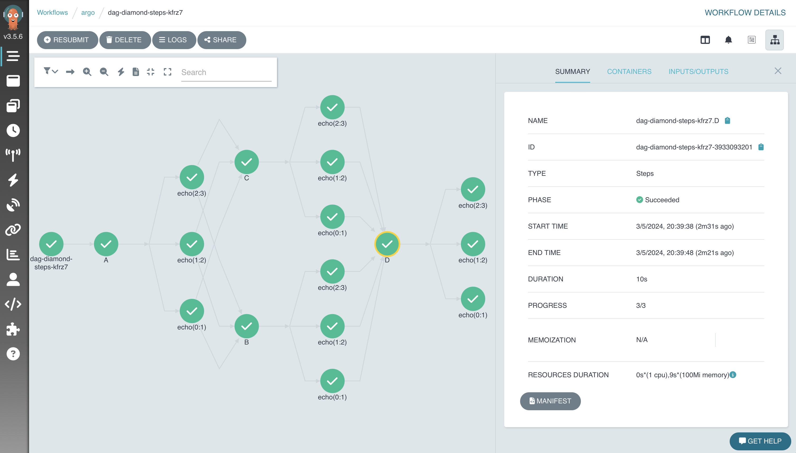
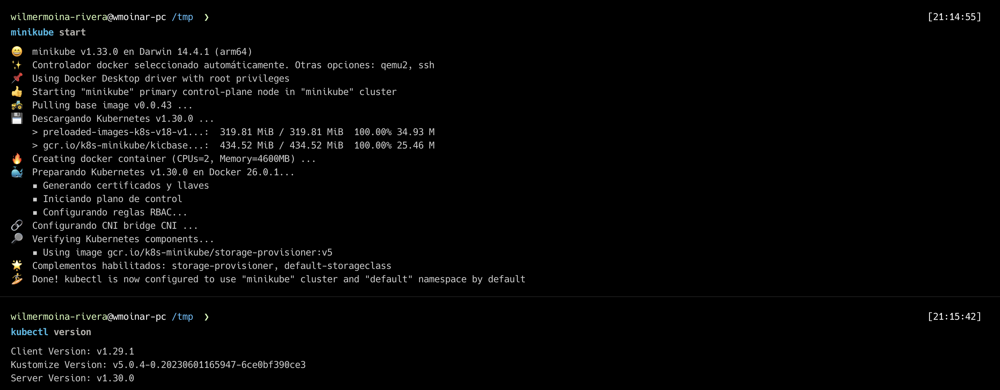
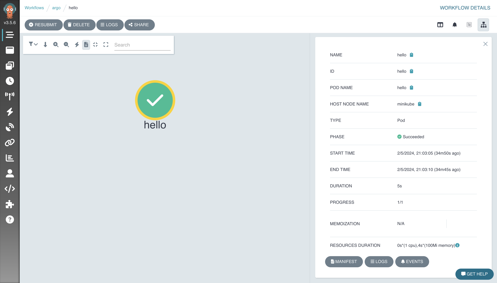
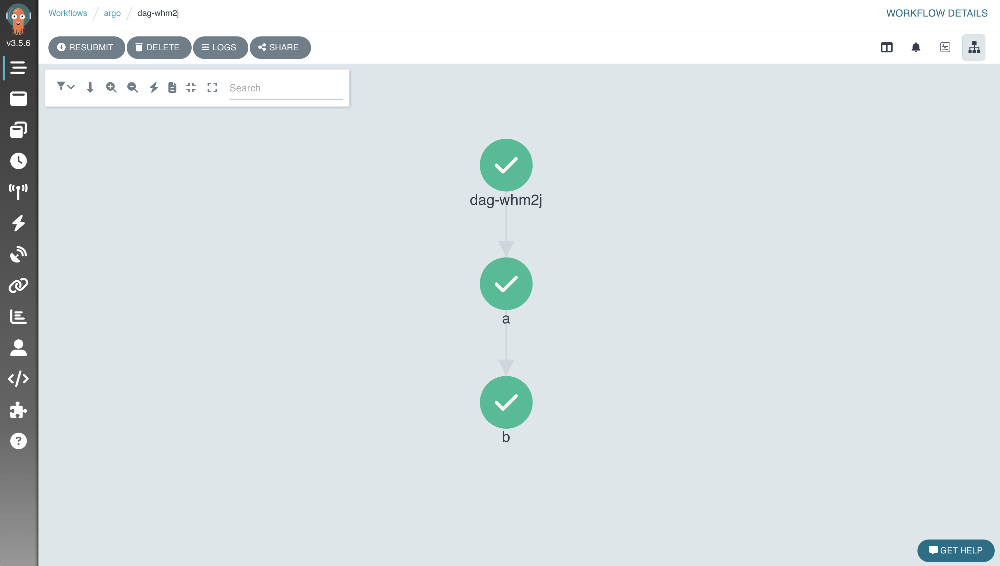
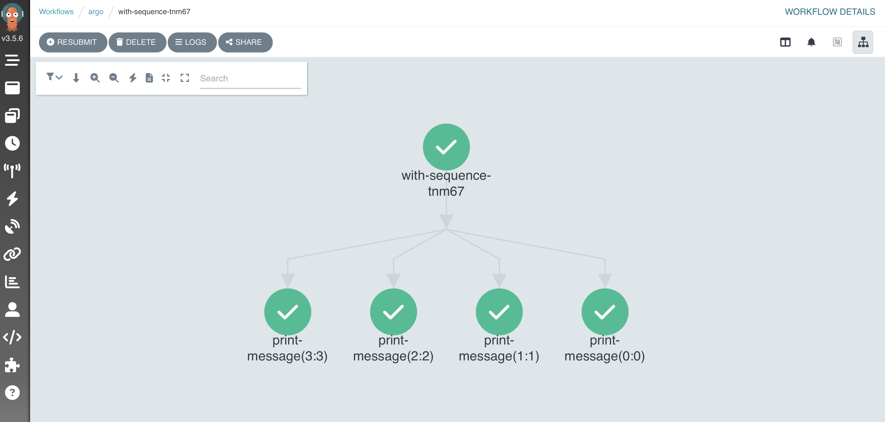
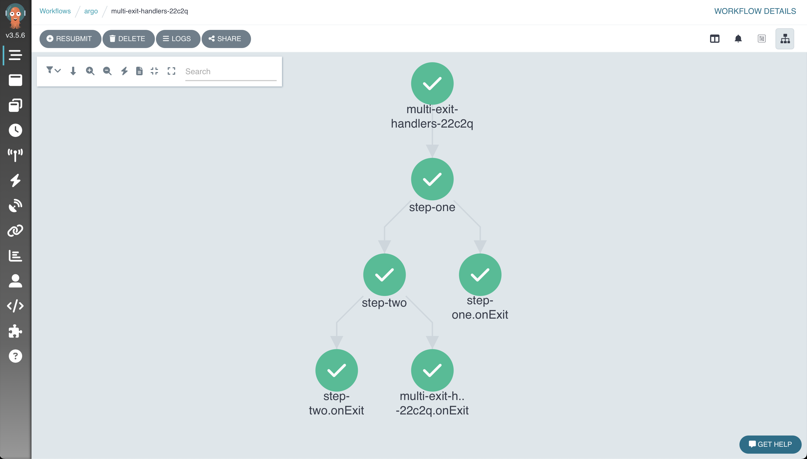
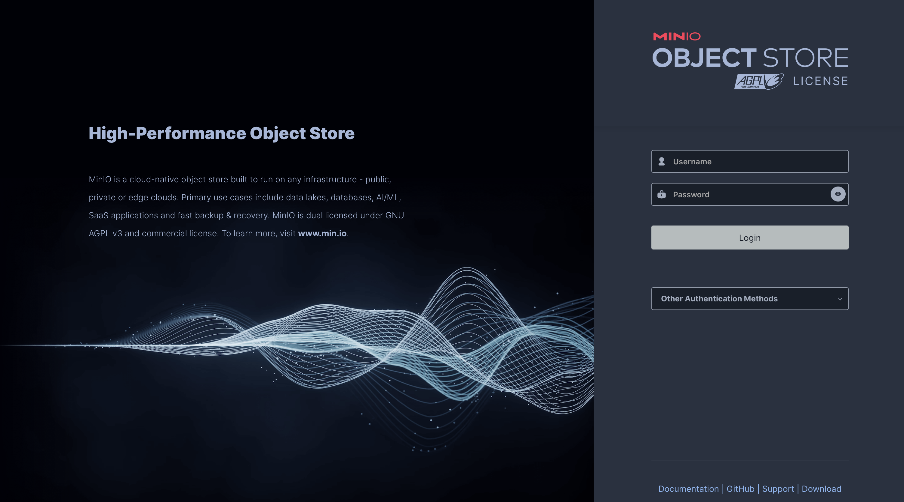
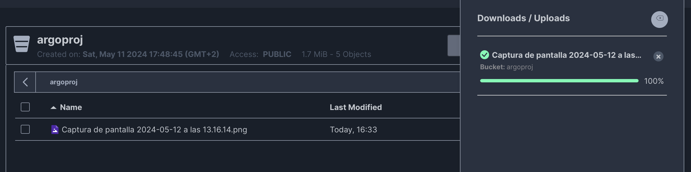
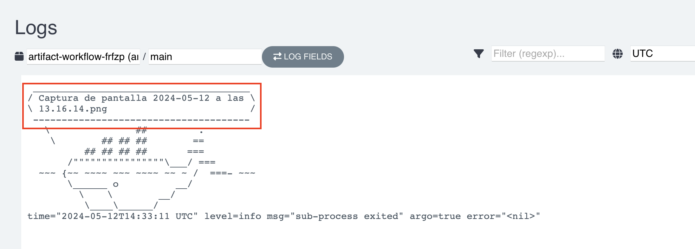

= Argo Workflows
:doctype: book
:author: Wilmer Moina-Rivera
:revdate: {docdate}
:toc: left
:icons: font
:sectnums:
:sectnumlevels: 3
:numbered:
:source-highlighter: pygments
:stylesheet: ArgoWorkflows.css
:linkcss:

== Introducción
=== Introducción a Kubernetes

Kubernetes es un sistema de orquestación de contenedores de código abierto que automatiza la implementación, el escalado y la gestión de aplicaciones en contenedores. Fue desarrollado originalmente por Google y ahora es mantenido por la Cloud Native Computing Foundation. Kubernetes permite a los desarrolladores y administradores de sistemas desplegar aplicaciones de manera consistente y escalable. Además, optimiza la confiabilidad y eficiencia, minimizando tanto el tiempo como los recursos necesarios para las operaciones diarias.

[.text-center]
.Clúster de Kubernetes (o k8s).

.Lectura recomendada
[TIP]
====
- https://kubernetes.io/es/docs/concepts/overview/what-is-kubernetes/[¿Qué es Kubernetes?, window="_blank"]
- https://cloud.google.com/learn/what-is-kubernetes?hl=es-419[Según Google, window="_blank"]
- https://azure.microsoft.com/es-es/solutions/kubernetes-on-azure/get-started/[Según Azure, window="_blank"]
- https://aws.amazon.com/es/kubernetes/[Según AWS, window="_blank"]

====

=== ¿Qué es Argo Workflows y por qué es importante?

Argo Workflows es un motor de flujo de trabajo de código abierto y nativo de contenedores, implementado como un Custom Resource Definition (CRD) en Kubernetes. Permite orquestar trabajos paralelos de manera eficiente, ideal para ejecutar tareas computacionalmente intensivas en menos tiempo. Su diseño optimizado para contenedores reduce la sobrecarga operativa, lo que lo hace crucial para entornos de producción flexibles y escalables.

[.text-center]
.Interfaz de usuario (UI) de Argo Workflows.

.Lectura recomendada
[TIP]
====
- https://argoproj.github.io/workflows/[¿Qué es Argo Workflows?, window="_blank"]
- https://argo-workflows.readthedocs.io/en/latest/[Documentación oficial, window="_blank"]
- https://medium.com/@lingxiankong/best-practice-of-using-argo-workflows-3162708f1bd5[Prácticas recomendadas, window="_blank"]
====

=== Casos de Uso Comunes de Argo Workflows en la Industria

Argo Workflows se utiliza ampliamente para automatizar pipelines de machine learning, procesamiento de datos y lotes, y automatización de infraestructura. También es esencial en la implementación de CI/CD y en otros escenarios que requieren orquestación robusta de tareas. Su capacidad para manejar tareas altamente paralelas sin la complejidad de sistemas basados en VM lo hace popular en diversas aplicaciones industriales.

.Lectura recomendada
[TIP]
====
- https://blog.argoproj.io/argo-workflows-events-2023-user-survey-results-82c53bc30543[Argo Workflows & Events 2023 User Survey Results, window="_blank"]
====

//== Conceptos Básicos de Argo Workflows

== Instalación y Configuración
=== Requisitos Previos

Para seguir este seminario, se requiere tener conocimientos básicos de Kubernetes y contenedores. Se recomienda tener acceso a un clúster de Kubernetes local (por ejemplo, Minikube) o remoto para realizar las prácticas. Además, es necesario tener instalado el cliente kubectl y minikube en su máquina local.

[NOTE]
====
- Para instalar minikube, siga las instrucciones en la página oficial de minikube:  https://minikube.sigs.k8s.io/docs/start/[minikube, window="_blank"].
- Para instalar kubectl, siga las instrucciones en la página oficial de Kubernetes: https://kubernetes.io/docs/tasks/tools/[kubectl, window="_blank"].
- La verisón de kubernetes utilizada en este seminario es la v1.30.0.
====

==== Iniciar un Clúster de Kubernetes Local
Arranque un clúster de Kubernetes local utilizando Minikube con el siguiente comando:
[source, bash]
----
minikube start
----
Salida esperada:

[.text-center]
.Minikube v1.33.0

=== Instalación de Argo Workflows

Una vez que Kubernetes esté listo, podemos instalar Argo Workflows en nuestro clúster. Argo se instala normalmente en un espacio de nombres llamado `argo`. Así que vamos a crearlo:

[source, bash]
----
kubectl create ns argo
----

A continuación, dirígete a la página de https://github.com/argoproj/argo-workflows/releases/tag/v3.4.17[lanzamientos, window="_blank"] y busca la versión que deseas usar (se recomienda la última versión).

De la sección `Controller and Server` copia y ejecuta los comandos de kubectl.

A continuación se muestra un ejemplo de los comandos de instalación; asegúrate de actualizar el comando para instalar el número de versión correcto:

[source, bash]
----
kubectl apply -n argo -f https://github.com/argoproj/argo-workflows/releases/download/v3.5.6/install.yaml
----

=== Configuración Inicial y Verificación

¿Qué se ha instalado? 

Tomará cerca de un minuto para que todos los despliegues estén disponibles. Vamos a ver qué se instaló mientras esperamos.

El `Workflow Controller` es responsable de ejecutar los `workflows`:

[source, bash]
----
kubectl -n argo get deploy workflow-controller
----

Y el Servidor de Argo proporciona una interfaz de usuario y API:

[source, bash]
----
kubectl -n argo get deploy argo-server
----

Antes de continuar, vamos a esperar (alrededor de 1 a 2 minutos) a que nuestros despliegues estén disponibles:

[source, bash]
----
kubectl -n argo wait deploy --all --for condition=Available --timeout 2m
----

[NOTE]
====
Para establecer en espacio de nombres predeterminado para Argo Workflows, puedes ejecutar el siguiente comando:
 
[source, bash]
----
kubectl config set-context --current --namespace=argo
----
====

Cómo configurar y verificar la instalación de Argo Workflows para asegurar su correcto funcionamiento.

== Primeros Pasos con Argo Workflows
=== ¿Qué es un workflow?

Un workflow se define como un recurso de Kubernetes. Cada workflow consta de una o más plantillas (`templates`), 
una de las cuales se define como el punto de entrada. Cada template puede ser de varios tipos; en este ejemplo, tenemos un template que es un contenedor.

[source,yaml]
----
apiVersion: argoproj.io/v1alpha1
kind: Workflow
metadata:
  name: hello
spec:
  serviceAccountName: argo // <1> 
  entrypoint: main // <2>
  templates:
  - name: main
    container: // <3>
      image: wmoinar/whalesay // <4> 
      command: ["cowsay"]
----

<1> Esta es la cuenta de servicio con la que se ejecutará el workflow
<2> El primer template que se ejecutará en el workflow
<3> Esta es una template de contenedor
<4> La imagen que se utilizará para ejecutar el contenedor

Dado que un workflow es un `recurso` más de Kubernetes, puedes utilizar `kubectl` con ellos.

=== Crear un workflow:

[source,bash]
----
kubectl -n argo apply -f examples/1_hello_word.yaml
----

Podemos verificar que el workflow se ha creado y completado con el siguiente comando:

[source,bash]
----
kubectl -n argo get pod -l workflows.argoproj.io/workflow=hello
----

=== Usando la Interfaz de Usuario

`argo-server` maneja la autenticación de los clientes en la interfaz de usuario (UI), exigiendo que estos proporcionen su token de Kubernetes para autenticarse. Puedes encontrar más información en la documentación oficial de Argo: https://argoproj.github.io/workflows/[Saber más, window="_blank"].

Para facilitar el acceso durante este laboratorio, configuraremos el modo de autenticación a `server`, lo que nos permitirá omitir el proceso de inicio de sesión en la UI temporalmente. Además, desactivaremos la comunicación segura por HTTPS.

[source,bash]
----
kubectl patch deployment argo-server \
  --namespace argo \
  --type='json' \
  -p='[{"op": "replace", "path": "/spec/template/spec/containers/0/args", "value": [
  "server",
  "--auth-mode=server",
  "--secure=false"
]},
{"op": "replace", "path": "/spec/template/spec/containers/0/readinessProbe/httpGet/scheme", "value": "HTTP"}
]'
----

Redesplegamos el servidor de Argo para aplicar los cambios:

[source,bash]
----
kubectl -n argo rollout status --watch --timeout=600s deployment/argo-server
----

Luego puedes visualizar la interfaz de usuario ejecutando un reenvío de puerto:

[source,bash]
----
kubectl -n argo port-forward --address 0.0.0.0 svc/argo-server 2746:2746 > /dev/null & #
----

Ahora puedes hacer clic aquí http://localhost:2746[Argo workflow,window="_blank"] para acceder a la UI. 

=== Ver el workflow

Abre la pestaña "Argo Server" y deberías ver la interfaz de usuario:

[.text-center]
.Workflow hello-work

=== Uso de la CLI

Para ejecutar workflows, la forma más fácil es utilizando la CLI de Argo, puedes descargarla de la siguiente manera (o en repositorio de https://github.com/argoproj/argo-workflows/releases/[Argo ,window="_blank"]):

[source,bash]
----
curl -sLO https://github.com/argoproj/argo-workflows/releases/download/v3.5.6/argo-linux-amd64.gz
gunzip argo-linux-amd64.gz
chmod +x argo-linux-amd64
mv ./argo-linux-amd64 /usr/local/bin/argo
----

Para verificar que se instaló correctamente:

[source,bash]
----
argo version
----

Deberías ver algo como esto:

[source,bash]
----
argo: v3.5.6
  BuildDate: 2024-04-19T21:32:35Z
  GitCommit: 555030053825dd61689a086cb3c2da329419325a
  GitTreeState: clean
  GitTag: v3.5.6
  GoVersion: go1.21.9
  Compiler: gc
  Platform: darwin/amd64
----

¡Vamos a ejecutar un workflow!

[source,bash]
----
argo submit -n argo --serviceaccount argo --watch examples/2_hello_work_cli.yaml
----

Deberías ver que el workflow se completa exitosamente después de aproximadamente 1 minuto:

[source,bash]
----
Name:                hello-world-q2dbl
Namespace:           argo
ServiceAccount:      argo
Status:              Succeeded
Conditions:
 PodRunning          False
 Completed           True
Created:             Fri May 03 00:00:28 +0200 (11 minutes ago)
Started:             Fri May 03 00:00:28 +0200 (11 minutes ago)
Finished:            Fri May 03 00:00:38 +0200 (11 minutes ago)
Duration:            10 seconds
Progress:            1/1
ResourcesDuration:   4s*(100Mi memory),0s*(1 cpu)

STEP                  TEMPLATE  PODNAME            DURATION  MESSAGE
 ✔ hello-world-q2dbl  whalesay  hello-world-q2dbl  4s
----

Puedes listar los workflows fácilmente:

[source,bash]
----
argo list -n argo
----

[source,bash]
----
NAME                STATUS      AGE   DURATION   PRIORITY   MESSAGE
hello-world-q2dbl   Succeeded   33m   10s        0
hello-work          Succeeded   2h    10s        0
hello               Succeeded   3h    10s        0
----

Obtén detalles sobre un workflow específico. `@latest` es un alias para el workflow más reciente:

[source,bash]
----
argo get -n argo @latest
----

Y puedes ver los logs de ese workflow:

[source,bash]
----
argo logs -n argo @latest
----

[source,bash]
----
hello-world-q2dbl:  _____________
hello-world-q2dbl: < hello world >
hello-world-q2dbl:  -------------
hello-world-q2dbl:    \               ##         .
hello-world-q2dbl:     \        ## ## ##        ==
hello-world-q2dbl:           ## ## ## ##       ===
hello-world-q2dbl:        /""""""""""""""""\___/ ===
hello-world-q2dbl:   ~~~ {~~ ~~~~ ~~~ ~~~~ ~~ ~ /  ===- ~~~
hello-world-q2dbl:        \______ o          __/
hello-world-q2dbl:          \    \        __/
hello-world-q2dbl:           \____\______/
hello-world-q2dbl: time="2024-05-02T22:00:31.948Z" level=info msg="sub-process exited" argo=true error="<nil>"
----

Finalmente, puedes obtener ayuda:

[source,bash]
----
argo --help
----

== Tipos de Templates

Existen varios tipos de templates, divididas en dos categorías diferentes: `work` y `orchestration`.

La primera categoría define el trabajo a realizar. Esto incluye:

* Container
* Container Set
* Data
* Resource
* Script

La segunda categoría orquesta el trabajo:

* DAG (Directed Acyclic Graph)
* Steps
* Suspend

.Lectura recomendada
[TIP]
====
- https://argo-workflows.readthedocs.io/en/latest/workflow-templates/[Workflow Templates, window="_blank"]
====

=== Template de Contenedor

Un template de contenedor es el tipo más común de template. Veamos un ejemplo completo:

[source,yaml]
----
apiVersion: argoproj.io/v1alpha1
kind: Workflow
metadata:
  generateName: container-
spec:
  entrypoint: main
  templates:
  - name: main
    container:
      image: wmoinar/whalesay
      command: [cowsay]
      args: ["hello world"]
----

Ahora, ejecutemos el workflow:

[source,bash]
----
argo submit -n argo --serviceaccount argo --watch examples/3_container_workflow.yaml
----

=== Etiquetas en un Template

Las etiquetas en un template (también conocidas como variables de template) son una forma de sustituir datos en tu workflow en tiempo de ejecución. Las etiquetas de template están delimitadas por `{{` y `}}` y serán reemplazadas en tiempo de ejecución.

Las etiquetas disponibles dependen del tipo de template, y hay varias globales que puedes utilizar, como `{{workflow.name}}`, que se reemplaza por el nombre del workflow:

[source,yaml]
----
apiVersion: argoproj.io/v1alpha1
kind: Workflow
metadata:
  generateName: template-tag-
spec:
  entrypoint: main
  templates:
    - name: main
      container:
        image: wmoinar/whalesay
        command: [cowsay]
        args: ["hello {{workflow.name}}"]
----

Envía este workflow:

[source,bash]
----
argo submit -n argo --serviceaccount argo --watch examples/4_template_tag.yaml
----

Puedes ver la salida ejecutando:

[source,bash]
----
argo logs @latest
----

Deberías ver algo como esto:

[source,bash]
----
template-tag-jnfzc:  __________________________
template-tag-jnfzc: < hello template-tag-jnfzc >
template-tag-jnfzc:  --------------------------
template-tag-jnfzc:    \               ##         .
template-tag-jnfzc:     \        ## ## ##        ==
template-tag-jnfzc:           ## ## ## ##       ===
template-tag-jnfzc:        /""""""""""""""""\___/ ===
template-tag-jnfzc:   ~~~ {~~ ~~~~ ~~~ ~~~~ ~~ ~ /  ===- ~~~
template-tag-jnfzc:        \______ o          __/
template-tag-jnfzc:          \    \        __/
template-tag-jnfzc:           \____\______/
template-tag-jnfzc: time="2024-05-03T11:04:21.923Z" level=info msg="sub-process exited" argo=true error="<nil>"
----

=== Work Templates
¿Qué otros tipos de work templates existen?

Un *template de conjunto de contenedores* permite ejecutar múltiples contenedores en un solo pod. Esto es útil cuando quieres que los contenedores compartan un espacio de trabajo común, o cuando deseas consolidar el tiempo de activación del pod en un paso de tu workflow.

Un *template de datos* te permite obtener datos de un almacenamiento (por ejemplo, S3). Esto es útil cuando cada elemento de datos representa un trabajo que necesita ser realizado.

Un *template de recurso* te permite crear un recurso de Kubernetes y esperar a que cumpla con una condición (por ejemplo, exitoso). Esto es útil si deseas interoperar con otro sistema de Kubernetes, como AWS Spark EMR.

Un *template de script* te permite ejecutar un script en un contenedor. Esto es muy similar a un template de contenedor, pero con un script añadido.

Cada tipo de template que realiza un trabajo, lo hace ejecutando un pod. Puedes usar `kubectl` para ver estos pods:

[source,bash]
----
kubectl get pods -l workflows.argoproj.io/workflow
----

Puedes identificar los pods de workflow por la etiqueta `workflows.argoproj.io/workflow`.

Deberías ver algo como esto:

[source,text]
----
NAME                 READY   STATUS      RESTARTS   AGE
container-9br6p      0/2     Completed   0          115m
hello                0/2     Completed   0          17h
hello-work           0/2     Completed   0          16h
template-tag-jnfzc   0/2     Completed   0          79m
----

=== Template DAG

Un template DAG es un tipo común de template de orquestación. Veamos un ejemplo completo:

[source,yaml]
----
apiVersion: argoproj.io/v1alpha1
kind: Workflow
metadata:
  generateName: dag-
spec:
  entrypoint: main
  templates:
    - name: main // <1>
      dag:
        tasks:
          - name: a
            template: whalesay
          - name: b
            template: whalesay
            dependencies:
              - a
    - name: whalesay // <2>
      container:
        image: wmoinar/whalesay
        command: [cowsay]
        args: ["hello world"]
----

En este ejemplo, tenemos dos templates:

<1> El template "main" es nuestro nuevo DAG.
<2> El template "whalesay" es el mismo que en el ejemplo de contenedor.

El DAG tiene dos tareas: "a" y "b". Ambas ejecutan el template "whalesay", pero como "b" depende de "a", no comenzará hasta que "a" haya completado exitosamente.

Ejecutemos el workflow:

[source,bash]
----
argo submit -n argo --serviceaccount argo --watch examples/5_dag_workflow.yaml
----

Deberías ver algo como esto:

[source,text]
----
STEP          TEMPLATE  PODNAME                       DURATION  MESSAGE
 ✔ dag-whm2j  main
 ├─✔ a        whalesay  dag-whm2j-whalesay-660405645  4s
 └─✔ b        whalesay  dag-whm2j-whalesay-610072788  5s
----

¿Notaste cómo "b" no comenzó hasta que "a" completó?

Abre la pestaña del Servidor Argo (http://localhost:2746[Ir,window="_blank"]) y navega al workflow, deberías ver dos contenedores.

.DAG Workflow
[.text-center]

=== Bucles (Loops)

La capacidad de ejecutar trabajos de procesamiento paralelo en gran escala es una de las características clave de Argo Workflows. Veamos cómo utilizar los bucles para esto.

==== withItems
Un DAG te permite iterar sobre una serie de elementos utilizando `withItems`:

[source,yaml]
----
      dag:
        tasks:
          - name: print-message
            template: whalesay
            arguments:
              parameters:
                - name: message
                  value: "{{item}}"
            withItems:
              - "hello world"
              - "ciao mondo"
----

En este ejemplo, se ejecutará una vez por cada uno de los elementos listados. Aquí podemos ver una etiqueta de template. `{{item}}` será reemplazada por "hello world" y "ciao mondo". Los DAGs se ejecutan en paralelo, así que ambas tareas se iniciarán al mismo tiempo.

Ejecuta el workflow:

[source,bash]
----
argo submit --watch examples/6_with_items_workflow.yaml
----

Deberías ver algo como esto:

[source,text]
----
STEP                               TEMPLATE  PODNAME                               DURATION  MESSAGE
 ✔ with-items-49mjs                main
 ├─✔ print-message(0:hello world)  whalesay  with-items-49mjs-whalesay-1503367336  4s
 └─✔ print-message(1:ciao mondo)   whalesay  with-items-49mjs-whalesay-1791799948  5s
----

Observa cómo los dos elementos se ejecutaron al mismo tiempo.

==== withSequence
También puedes iterar sobre una secuencia de números utilizando `withSequence`:

[source,yaml]
----
      dag:
        tasks:
          - name: print-message
            template: whalesay
            arguments:
              parameters:
                - name: message
                  value: "{{item}}"
            withSequence:
              count: 4
----

Como de costumbre, ejecútalo:

[source,bash]
----
argo submit --watch examples/7_with_sequence_workflow.yaml
----

Deberías ver algo como esto:

[source,text]
----
STEP                     TEMPLATE  PODNAME                                  DURATION  MESSAGE
 ✔ with-sequence-tnm67   main
 ├─✔ print-message(0:0)  whalesay  with-sequence-tnm67-whalesay-1551215270  6s
 ├─✔ print-message(1:1)  whalesay  with-sequence-tnm67-whalesay-2190561570  5s
 ├─✔ print-message(2:2)  whalesay  with-sequence-tnm67-whalesay-1568889174  8s
 └─✔ print-message(3:3)  whalesay  with-sequence-tnm67-whalesay-1540049194  7s
----

Observa cómo se ejecutaron 5 pods al mismo tiempo y que sus nombres incluyen el valor del ítem, indexado desde cero.

.WitSequence Workflow
[.text-center]

=== Templates de Orquestación

Hemos aprendido que un *template DAG* es un tipo de template de orquestación. ¿Qué otros tipos de templates de orquestación existen?

Los *Steps template* te permite ejecutar una serie de pasos en secuencia.

Los *suspend template* te permite suspender automáticamente un workflow, por ejemplo, mientras se espera una aprobación manual o mientras un sistema externo realiza algún trabajo.

=== Manejador de Salida

Si necesitas realizar una tarea después de que algo haya terminado, puedes utilizar un manejador de salida. Los manejadores de salida se especifican usando `onExit`:

[source,yaml]
----
      dag:
        tasks:
          - name: a
            template: whalesay
            onExit: tidy-up
----

Simplemente indica el nombre del template que debe ejecutarse al finalizar. 

Veamos un ejemplo completo:

[source,bash]
----
cat examples/8_exit_handler_workflow.yaml
----

Ejecútalo:

[source,bash]
----
argo submit --watch examples/8_exit_handler_workflow.yaml
----

Deberías ver:

[source,text]
----
STEP                   TEMPLATE  PODNAME                                DURATION  MESSAGE
 ✔ exit-handler-7mq52  main
 ├─✔ a                 whalesay  exit-handler-7mq52-whalesay-970555148  4s
 └─✔ a.onExit          tidy-up   exit-handler-7mq52-tidy-up-3394673695  5s
----

Se puede utilizar varios manejadores de salida en un solo template, y un manejador global de salida para todo el workflow.
por ejemplo:

[source,yaml]
----
  entrypoint: main
  onExit: global-cleanup // <1> 
  templates:
    - name: main
      dag:
        tasks:
          - name: step-one
            template: primary-action
            onExit: cleanup-after-step-one  // <2> 

          - name: step-two
            template: secondary-action
            dependencies: [step-one]
            onExit: cleanup-after-step-two  // <3> 

    - name: primary-action
      container:
        image: wmoinar/whalesay
        command: [cowsay]
        args: ["Doing primary action"]

    - name: secondary-action
      container:
        image: wmoinar/whalesay
        command: [cowsay]
        args: ["Doing secondary action"]

    - name: cleanup-after-step-one
      container:
        image: wmoinar/whalesay
        command: [cowsay]
        args: ["Cleanup after step one"]

    - name: cleanup-after-step-two
      container:
        image: wmoinar/whalesay
        command: [cowsay]
        args: ["Cleanup after step two"]

    - name: global-cleanup
      container:
        image: wmoinar/whalesay
        command: [cowsay]
        args: ["Performing global cleanup"]

----
<1> Este manejador se ejecuta cuando todo el workflow finaliza o falla.
<2> Manejador de salida específico para esta tarea.
<3> Otro manejador de salida específico para esta segunda tarea.

Ejecútalo:

[source,bash]
----
argo submit --watch examples/9_exit_multi_handler_workflow.yaml
----

Deberías ver:

.Multiple Exit Handler Workflow
[.text-center]

== Entradas y Salidas
=== Parámetros

Los parámetros son un tipo de entrada o salida que consisten en valores de texto simples. A diferencia de los artefactos, que pueden ser archivos o conjuntos de datos complejos, los parámetros son ideales para transmitir información sencilla y directa a lo largo de un workflow.

=== Parámetros de Entrada

Veamos un ejemplo:

[source,yaml]
----
- name: main
  inputs:
    parameters:
      - name: message
  container:
    image: wmoinar/whalesay
    command: [cowsay]
    args: ["{{inputs.parameters.message}}"]
----

Este template declara que tiene un parámetro de entrada llamado "message".

Ve el workflow completo:

[source,bash]
----
cat examples/10_input_parameters_workflow.yaml
----

Observa cómo el propio workflow tiene argumentos.

Ejecútalo:

[source,bash]
----
argo submit --watch examples/10_input_parameters_workflow.yaml
----

Deberías ver:

[source,text]
----
STEP                       TEMPLATE  PODNAME                 DURATION  MESSAGE
 ✔ input-parameters-pxrmj  main      input-parameters-pxrmj  7s
----

Si un workflow tiene parámetros, puedes cambiar los parámetros usando `-p` con la CLI:

[source,bash]
----
argo submit --watch examples/10_input_parameters_workflow.yaml -p message='¡Bienvenido a Argo!'
----

Deberías ver:

[source,text]
----
STEP                       TEMPLATE  PODNAME                 DURATION  MESSAGE
 ✔ input-parameters-qg452  main      input-parameters-qg452  11s
----

Revisa la salida en los logs:

[source,bash]
----
argo logs @latest
----

Deberías ver:

[source,text]
----
:  ______________________
: < ¡Bienvenido a Argo! >
:  ----------------------
:    \               ##         .
:     \        ## ## ##        ==
:           ## ## ## ##       ===
:        /""""""""""""""""\___/ ===
:   ~~~ {~~ ~~~~ ~~~ ~~~~ ~~ ~ /  ===- ~~~
:        \______ o          __/
:          \    \        __/
:           \____\______/
: time="2024-05-04T21:43:14.087Z" level=info msg="sub-process exited" argo=true error="<nil>"
----

=== Parámetros de Salida

Los parámetros de salida pueden provenir de varios lugares, pero típicamente el más versátil es de un archivo. En este ejemplo, el contenedor crea un archivo con un mensaje en él:

[source,yaml]
----
- name: whalesay
  container:
    image: wmoinar/whalesay
    command: [sh, -c] // 
    args: ["echo -n hello world > /tmp/hello_world.txt"] // <1>
  outputs:
    parameters:
    - name: hello-param
      valueFrom:
        path: /tmp/hello_world.txt // <2>
----
<1> Crea un archivo con un mensaje.
<2> Referencia al archivo creado.

En los templates de tipo DAG y de pasos (steps), es posible utilizar las salidas de una tarea como entradas para otra tarea, mediante el uso de etiquetas de template. Esto facilita la interconexión y dependencia directa entre tareas dentro del workflow.

[source,yaml]
----
dag:
  tasks:
    - name: generate-parameter // <1>
      template: whalesay
    - name: consume-parameter // <2>
      template: print-message
      dependencies:
        - generate-parameter
      arguments:
        parameters:
          - name: message
            value: "{{tasks.generate-parameter.outputs.parameters.hello-param}}" // <3>
----
<1> La tarea que genera el parámetro.
<2> La tarea que consume el parámetro.
<3> El valor del parámetro generado.

Ve el workflow completo:

[source,bash]
----
cat examples/11_output_parameters_workflow.yaml
----

Ejecútalo:

[source,bash]
----
argo submit --watch examples/11_output_parameters_workflow.yaml
----

Deberías ver:

[source,text]
----
STEP                     TEMPLATE       PODNAME                                   DURATION  MESSAGE
 ✔ parameters-t64zg      main
 ├─✔ generate-parameter  whalesay       parameters-t64zg-whalesay-2318848988      5s
 └─✔ consume-parameter   print-message  parameters-t64zg-print-message-796340527  4s
----
.Lectura recomendada
[TIP]
====
- https://argo-workflows.readthedocs.io/en/latest/walk-through/parameters/[Parámetros, window="_blank"]
- https://argo-workflows.readthedocs.io/en/latest/workflow-inputs/[Parámetros de Entrada, window="_blank"]
====

=== Artefactos

Un artefacto es simplemente un archivo que se comprime y almacena en un almacenamiento de objetos (como https://aws.amazon.com/es/s3/[S3, window="_blank"], https://min.io[MinIO, window="_blank"], https://cloud.google.com/storage?hl=es_419[GCS, window="_blank"], etc.).

En Argo, hay dos tipos de artefactos:

* Un *artefacto de entrada* es un archivo descargado desde el almacenamiento (p. ej., S3) y montado como un volumen dentro del contenedor.
* Un *artefacto de salida* es un archivo creado en el contenedor que luego se sube al almacenamiento.

Los artefactos generalmente se cargan en un bucket dentro de algún tipo de almacenamiento como AWS S3 o GCP GCS. Llamamos a este almacenamiento un repositorio de artefactos. En este laboratorio usaremos MinIO.

==== Artefactos de Salida

Cada tarea dentro de un workflow puede producir artefactos de salida. Para especificar un artefacto de salida, debes incluir `outputs` en el manifiesto. Cada artefacto de salida declara:

[source,yaml]
----
- name: save-message
  container:
    image: wmoina/whalesay
    command: [sh, -c]
    args: ["cowsay hello world > /tmp/hello_world.txt"]
  outputs:
    artifacts:
      - name: hello-art // <1>
        path: /tmp/hello_world.txt // <2>
----

<1> La ruta dentro del contenedor donde se puede encontrar.
<2> Un nombre para poder referenciarlo.

Cuando el contenedor se completa, el archivo se copia fuera de él, se comprime y se almacena.

Los archivos también pueden ser directorios, por lo que cuando se encuentra un directorio, todos los archivos se comprimen en un archivo y se almacenan.

==== Artefactos de Entrada

Para declarar un artefacto de entrada, debes incluir `inputs` en el manifiesto. Cada artefacto de entrada debe declarar:

[source,yaml]
----
- name: print-message
  inputs:
    artifacts:
      - name: message // <1>
        path: /tmp/message // <2>
  container:
    image: wmoinar/whalesay
    command: [sh, -c]
    args: ["cat /tmp/message"]
----

<1> Su nombre.
<2> La ruta donde debe ser creado.

Si el artefacto era un directorio comprimido, se descomprimirá y desempaquetará en la ruta especificada.

==== Entradas y Salidas (artefactos)

[NOTE]
====
- Para ejecutar este ejemplo necesitaremos instalar MinIO. Sigue las instrucciones en la sección de <<prerequisites, Argo-Events.Prerrequisitos>>.
- Asegúrate de que MinIO esté instalado y funcionando antes de continuar.
- Crear un bucket llamado `argo-artifacts` en MinIO.
====

No puedes usar entradas y salidas de forma aislada; necesitas combinarlas utilizando un template de pasos o DAG, como en el siguiente ejemplo:

[source,yaml]
----
- name: main
  dag:
    tasks:
      - name: generate-artifact
        template: save-message
      - name: consume-artifact
        template: print-message
        dependencies:
          - generate-artifact
        arguments:
          artifacts:
            - name: message
              from: "{{tasks.generate-artifact.outputs.artifacts.hello-art}}"
----

En el ejemplo anterior, `arguments` se usa para declarar el valor de la entrada del artefacto. Esto utiliza una etiqueta de template. En este ejemplo, `{{tasks.generate-artifact.outputs.artifacts.hello-art}}` se convierte en la ruta del artefacto en el repositorio.

La tarea `consume-artifact` debe ejecutarse después de `generate-artifact`, por lo que usamos `dependencies` para declarar esa relación.

Veamos el workflow DAG completo:

[source,bash]
----
cat examples/12_artifacts_workflow.yaml
----

Ejecutemos un ejemplo:

[source,bash]
----
argo submit --watch examples/12_artifacts_workflow.yaml
----

Deberías ver:

[source,text]
----
STEP                    TEMPLATE       PODNAME                     DURATION  MESSAGE
 ✔ artifacts-qvcpn      main
 ├─✔ generate-artifact  save-message   artifacts-qvcpn-3260493969  7s
 └─✔ consume-artifact   print-message  artifacts-qvcpn-2991781604  8s
----

.Lectura recomendada
[TIP]
====
- https://argo-workflows.readthedocs.io/en/latest/walk-through/artifacts/[Artifacts overview, window="_blank"]
- https://argo-workflows.readthedocs.io/en/latest/configure-artifact-repository/[Configuring an artifact repository, window="_blank"]
- https://argo-workflows.readthedocs.io/en/latest/key-only-artifacts/[Key-only artifacts, window="_blank"]
- https://argo-workflows.readthedocs.io/en/latest/artifact-repository-ref/[Referencing artifact repositories, window="_blank"]
====

== Argo Events

[[prerequisites]]
=== Prerequisitos
 
Para ejecutar los ejemplos de Argo Events, primero necesitas tener Minio instalado. Puedes seguir la guía oficial de Minio en el siguiente enlace: https://min.io/docs/minio/kubernetes/upstream/index.html[Guía de inicio rápido de Minio, window="_blank"], o puedes usar el siguiente comando para instalar Minio en tu clúster de Minikube:

[source,bash]
----
kubectl apply -f examples/minio.yaml 
----

Para verificar que Minio se ha instalado correctamente, ejecuta el siguiente comando:
[source,bash]
----
kubectl -n argo wait deploy minio --for condition=Available --timeout 2m
----

Dar acceso a Minio para almacenar artefactos de Argo Events:

[source,bash]
----
kubectl apply -f examples/minio_artifacts.yaml 
----

Después de aplicar las configuraciones, reinicia el controlador de workflows:

[source,bash]
----
kubectl rollout restart deployment workflow-controller -n argo
----

=== Conecta tu Navegador al Servidor MinIO

Para acceder a la interfaz de Minio, crea un reenvío de puerto:
[source,bash]
----
kubectl -n argo port-forward --address 0.0.0.0 svc/minio 9001:9001  > /dev/null & #
----

Accede a la Consola de MinIO abriendo un navegador en la máquina local y navegando a http://127.0.0.1:9001[http://127.0.0.1:9001, window="_blank"]. Inicia sesión en la Consola con las credenciales `argoproj` | `UVseminario24`. Estas son las credenciales predeterminadas del usuario raíz.

.Minio Dashboard
[.text-center]

=== Instalar y Configurar Argo Events

Argo Events normalmente se instala en un espacio de nombres llamado argo-events, así que vamos a crearlo:

[source,bash]
----
kubectl create ns argo-events
----

A continuación, dirígete a la página de versiones y encuentra la versión que deseas usar (se prefiere la última versión completa).

A continuación, un ejemplo del comando de instalación:

[source,bash]
----
kubectl apply -n argo-events -f https://github.com/argoproj/argo-events/releases/download/v1.9.1/install.yaml
----

Argo Events también requiere la creación de un eventbus. Este es un punto central al que se envían todos los eventos. El eventbus se crea en el mismo espacio de nombres que el controlador de Argo Events.

Hay un ejemplo disponible en el repositorio de GitHub de Argo Events. Ejecuta el siguiente comando para crear el eventbus:

[source,bash]
----
kubectl apply -n argo-events -f https://raw.githubusercontent.com/argoproj/argo-events/stable/examples/eventbus/native.yaml
----

Queremos que Argo Events active un flujo de trabajo cuando se agregue un archivo a Minio. Para lograr esto, agregaremos un eventsource de Minio que escuchará los eventos de Minio.

El eventsource requerirá credenciales de Minio. Proporcionaremos estas credenciales en forma de un secreto. Visualiza el secreto con:

[source,bash]
----
cat examples/minio_secret.yaml
----

Implementa el secreto con:
[source,bash]
----
kubectl apply -n argo-events -f examples/minio_secret.yaml
----

Antes de implementar el eventsource, necesitamos crear un bucket en Minio. Puedes hacerlo desde la interfaz, utiliza el nombre `argoproj`.

Una vez que hayas creado el bucket, visualiza el eventsource con:

[source,yaml]
----
apiVersion: argoproj.io/v1alpha1
kind: EventSource
metadata:
  name: minio
  namespace: argo-events
spec:
  minio:
    example:
      bucket:
        name: argoproj // <1>
      endpoint: minio.argo:9000 // <2>
      events: // <3>
        - s3:ObjectCreated:Put
        - s3:ObjectRemoved:DeleteMarkerCreated

      insecure: true // <4>
      accessKey: // <5>
        key: accesskey
        name: minio-creds
      secretKey: // <6>
        key: secretkey
        name: minio-creds
----
<1> Nombre del bucket
<2> Punto de conexión del servicio S3
<3> Lista de eventos a los que suscribirse. Visita https://docs.minio.io/docs/minio-bucket-notification-guide.html
<4> Tipo de conexión
<5> Clave dentro del secreto de K8s que almacena la clave de acceso
<6> Clave dentro del secreto de K8s que almacena la clave secreta

Implementa el eventsource con: 
[source,bash]
----
kubectl apply -n argo-events -f examples/minio_eventsource.yaml
----

==== ¿Qué se instaló?

Puede tardar aproximadamente 1 minuto en que todas las implementaciones estén disponibles. Veamos qué se instaló mientras esperamos.

El Gestor de Controladores de Eventos: 

[source,bash]
----
kubectl -n argo-events get deploy controller-manager
----

Un estado de eventbus statefulset: 
[source,bash]
----
kubectl -n argo-events get statefulsets eventbus-default-stan
----

Un pod de eventsource de Minio: 

[source,bash]
----
kubectl -n argo-events get pod -l eventsource-name=minio
----

=== Agregar un Sensor y Disparador de Minio

Necesitamos instalar un Sensor que sea llamado por el EventSource. El Sensor es responsable de activar la creación de un flujo de trabajo cuando se recibe un evento. Veamos la configuración del Sensor:

[source,bash]
----
cat examples/minio_sensor.yaml
----

Despliega con el siguiente comando:

[source,bash]
----
kubectl apply -n argo-events -f examples/minio_sensor.yaml
----

Esto crea finalmente un pod en nuestro espacio de nombres `argo-events` que es responsable de activar flujos de trabajo cuando se reciben eventos.

"This service account does not have permission to create workflows in the argo namespace. We therefore need to give it permission to do so."

Necesitamos ortorgar permisos a la cuenta de servicio `default` para crear workflows. Para hacer esto, necesitamos crear un `ClusterRole` y un `ClusterRoleBinding`:

[source,bash]
----
kubectl apply -f examples/minio_sa.yaml
----

Podemos ver que está configurado para observar el bucket de Minio llamado `argoproj`. Si creamos o eliminamos un archivo en este bucket, se activará un evento.

=== Crear un Flujo de Trabajo
 
Cargamos un archivo en el bucket `argoproj` en Minio. Puedes hacerlo desde la interfaz de Minio:

.Carga de Archivo
[.text-center]

Esto debería activar un evento en el EventSource de Minio. El Sensor debería detectar este evento y activar un workflow.

Veamos los registros del pod del sensor:

[source,bash]
----
kubectl -n argo-events logs -l sensor-name=minio 
----

[source,json]
----
{
  "level": "info",
  "ts": 1715524387.6334236,
  "logger": "argo-events.sensor",
  "caller": "sensors/listener.go:433",
  "msg": "Successfully processed trigger 'minio-workflow-trigger'",
  "sensorName": "minio",
  "triggerName": "minio-workflow-trigger",
  "triggerType": "Kubernetes",
  "triggeredBy": [
    "example-dep"
  ],
  "triggeredByEvents": [
    "31336131313836312d313362342d343766662d613663332d633336303932623961643035"
  ]
}
----

Si todo ha ido bien hasta ahora, deberías ver un mensaje similar al anterior. Esto indica que el Sensor ha detectado un evento y ha activado un flujo de trabajo. 

Desde la interfaz de Argo, puedes ver el flujo de trabajo activado:

.Argo UI
[.text-center]

==== Proceso Detallado

. Evento en MinIO:
  * Un usuario sube un archivo a `my-bucket` en MinIO.
  * MinIO genera un evento `s3:ObjectCreated:*`.

. Detección del Evento por el Event Source:
  * El Event Source `minio-event-source` monitorea `argoproj` y detecta el evento de creación de objeto.
  * El Event Source envía el evento al EventBus.

. Transporte del Evento por el EventBus:
  * El EventBus recibe el evento del Event Source y lo envía a los Sensors suscritos.

. Activación del Sensor:
  * El Sensor `minio-sensor` está suscrito a los eventos del Event Source `minio-event-source`.
  * El Sensor recibe el evento y activa su trigger configurado.

. Ejecución del Workflow en Argo Workflows:
  * El trigger del Sensor somete un nuevo Workflow de Argo (`triggered-workflow`).
  * El Workflow se ejecuta según la configuración definida, en este caso, imprime un mensaje usando la imagen `wmoinar/whalesay`.

. Diagrama del Flujo de Trabajo:

  MinIO (evento de creación de objeto) →

  Event Source (detecta el evento) →

  EventBus (transporte del evento) →

  Sensor (recibe el evento y activa el trigger) →

  Argo Workflows (ejecuta el workflow).

== Conclusiones

En este laboratorio, hemos explorado los conceptos fundamentales y la configuración básica de Argo Workflows, una poderosa herramienta de orquestación de flujos de trabajo para Kubernetes. A continuación, se resumen los puntos clave tratados:

. **Comprensión de Argo Workflows**:
  * Argo Workflows es una herramienta nativa de Kubernetes que facilita la creación y gestión de flujos de trabajo complejos.
  * Permite la definición de tareas que se ejecutan en contenedores y su organización en estructuras secuenciales o paralelas.

. **Instalación y Configuración**:
  * Instalamos Argo Workflows en un clúster de Kubernetes, asegurando que todos los componentes necesarios estuvieran en funcionamiento.
  * Configuramos y verificamos la instalación para garantizar que el entorno esté listo para ejecutar flujos de trabajo.

. **Creación y Ejecución de Workflows**:
  * Aprendimos a definir workflows en YAML, especificando tareas y sus relaciones mediante templates.
  * Ejecutamos workflows utilizando tanto la CLI de Argo como la interfaz de usuario web, observando cómo se desarrollan y completan las tareas.

. **Tipos de Templates**:
  * Exploramos diversos tipos de templates, incluyendo contenedores, scripts, y DAGs, que nos permiten modelar tareas de manera flexible y escalable.
  * Entendimos cómo utilizar los templates de orquestación como DAG y Steps para estructurar flujos de trabajo complejos.

. **Argo Events**:
  * Configuramos Argo Events para reaccionar a eventos externos, integrando MinIO como fuente de eventos.
  * Implementamos Event Sources, EventBus y Sensors para detectar eventos en MinIO y desencadenar la ejecución de workflows en Argo.

. **Automatización y Escalabilidad**:
  * Demostramos cómo Argo Workflows y Argo Events juntos pueden automatizar procesos en respuesta a eventos, mejorando la eficiencia y escalabilidad de las operaciones.

[pass]
++++
<link href="https://cdn.jsdelivr.net/npm/bootstrap@5.1.3/dist/css/bootstrap.min.css" rel="stylesheet" integrity="sha384-1BmE4kWBq78iYhFldvKuhfTAU6auU8tT94WrHftjDbrCEXSU1oBoqyl2QvZ6jIW3" crossorigin="anonymous">

++++

// [source,python]
// ----
// #Resizes an image and keeps aspect ratio. Set mywidth to the desired with in pixels.

// import PIL
// from PIL import Image

// mywidth = 1920

// img = Image.open('homer-retard.jpg')
// wpercent = (mywidth/float(img.size[0]))
// hsize = int((float(img.size[1])*float(wpercent)))
// img = img.resize((mywidth,hsize), PIL.Image.ANTIALIAS)
// img.save('resized.jpg')
// ----

// https://github.com/Carleslc/ImageToText.git